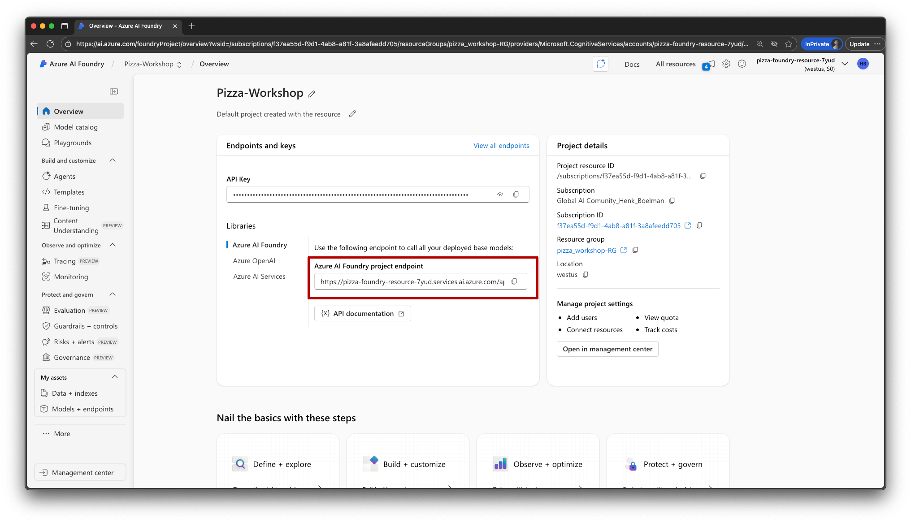

# Create Your First Agent  

In this chapter, we’ll walk through the process of creating your very first AI agent using the **Azure AI Foundry Agent Service**.  
By the end, you’ll have a simple agent running locally that you can interact with in real time.  

First switch back to the Github codespace environment you created earlier. Make sure the terminal pane is still opened on the **workshop** folder.


## Login to Azure  

Before you can use the Azure AI Foundry Agent Service, you need to sign in to your Azure subscription.  

Run the following command and follow the on-screen instructions. Use credentials that have access to your Azure AI Foundry resource:  

```shell
az login --use-device-code
```


## Install Required Packages  

Next, install the Python packages needed to work with Azure AI Foundry and manage environment variables:  

```shell
pip install azure-identity
pip install azure-ai-projects
pip install azure-ai-agents==1.2.0b5
pip install jsonref
pip install python-dotenv
```


### Create a `.env` File  

We’ll store secrets (such as your project connection string) in an environment file for security and flexibility.  

1. **Create a file named `.env` in the root of your project directory.**

2. **Add the following line to the file:**

    ```env
    PROJECT_CONNECTION_STRING="https://<your-foundry-resource>.services.ai.azure.com/projects/<your-project-name>"
    ```

Replace `https://<your-foundry-resource>.services.ai.azure.com/api/projects/<your-project-name>` with the actual values from your Azure AI Foundry project. 

  


3. **Where to find your connection string:**

   - Go to the **Azure AI Foundry portal**
   - Navigate to your project
   - Click on **Overview**
   - The connection string will be displayed on the homepage of your project


### 📝 Notes

- Make sure there are **no spaces** around the `=` sign in the `.env` file.


## Create a Basic Agent  

We’ll now create a basic Python script that defines and runs an agent.  

- Start by creating a new file called: **`agent.py`** in the **workshop** folder


### Add Imports to `agent.py`  

These imports bring in the Azure SDK, environment handling, and helper classes:  

```python
import os
from azure.ai.projects import AIProjectClient
from azure.identity import DefaultAzureCredential
from azure.ai.agents.models import MessageRole, FilePurpose, FunctionTool, FileSearchTool, ToolSet
from dotenv import load_dotenv
```

### Load the `.env` File  

Load environment variables into your script by adding this line to `agent.py`:  

```python
load_dotenv(override=True)
```


### Create an `AIProjectClient` Instance  

This client connects your script to the Azure AI Foundry service using the connection string and your Azure credentials.  

```python
project_client = AIProjectClient(
    endpoint=os.environ["PROJECT_CONNECTION_STRING"],
    credential=DefaultAzureCredential()
)
```


### Create the Agent  

Now, let’s create the agent itself. In this case, it will use the **GPT-4o** model.  

```python
agent = project_client.agents.create_agent(
    model="gpt-4o",
    name="my-agent"
)
print(f"Created agent, ID: {agent.id}")
```


### Create a Thread  

Agents interact within threads. A thread is like a conversation container that stores all messages exchanged between the user and the agent.  

```python
thread = project_client.agents.threads.create()
print(f"Created thread, ID: {thread.id}")
```


### Add a Message  

This loop lets you send messages to the agent. Type into the terminal, and the message will be added to the thread.  

```python
try:
    while True:

        # Get the user input
        user_input = input("You: ")

        # Break out of the loop
        if user_input.lower() in ["exit", "quit"]:
            break

        # Add a message to the thread
        message = project_client.agents.messages.create(
            thread_id=thread.id,
            role=MessageRole.USER, 
            content=user_input
    )
```


### Create and Process an Agent Run  

The agent processes the conversation thread and generates a response.  

```python
        run = project_client.agents.runs.create_and_process(
            thread_id=thread.id, 
            agent_id=agent.id
        )
```


### Fetch All Messages from the Thread  

This retrieves all messages from the thread and prints the agent’s most recent response.  

```python
        messages = project_client.agents.messages.list(thread_id=thread.id)
        first_message = next(iter(messages), None) 
        if first_message: 
            print(next((item["text"]["value"] for item in first_message.content if item.get("type") == "text"), "")) 
```


### Delete the Agent When Done  

Once you’re finished, clean up by deleting the agent:  

```python
finally:
    # Clean up the agent when done
    project_client.agents.delete_agent(agent.id)
    print("Deleted agent")
```

Add this code to delete the agent outside of the while True-loop. Otherwise the agent will be deleted immediately after your first interaction.


## Run the Agent  

Finally, run the Python script:  

```shell
python agent.py
```

You can now chat with your agent directly in the terminal. Type `exit` or `quit` to stop the conversation.  

## Debugging 

If you get an error (the principal `*****-****-***-****-*****`) does **not have permission** to create assistants in your Azure AI Foundry project. Specifically, it's missing the **`Microsoft.CognitiveServices/accounts/AIServices/agents/write`** data action.

Here’s how to fix it:

1. **Go to the Azure Portal**: [https://portal.azure.com](https://portal.azure.com)

2. **Navigate to your Azure AI Foundry resource**:
   - You can find it by searching for the name of your Foundry resource (e.g., `my-foundry-name`).

3. **Open the “Access Control (IAM)” panel**:
   - In the left-hand menu of the resource, click **Access Control (IAM)**.

4. **Click “Add role assignment”**:
   - Choose **Add → Add role assignment**
   - Select a role that includes the required data action:
     - Recommended: **Cognitive Services Contributor** or a **custom role** that includes `Microsoft.CognitiveServices/accounts/AIServices/agents/write`

5. **Assign the role to your principal**:
   - Use the Object ID or name of the principal: `******-****-***-********`
   - This might be a service principal, user, or managed identity depending on your setup.

6. **Save and confirm**:
   - Once assigned, wait a few minutes for the permission to propagate.
   - Retry the operation to create the assistant.


## Recap  

In this chapter, you have:  

- Logged in to Azure  
- Retrieved a connection string  
- Separated secrets from code using `.env`  
- Created a basic agent with the Azure AI Foundry Agent Service  
- Started a conversation with a **GPT-4o** model  
- Cleaned up by deleting the agent when done  


## Final code sample

```python 
<!--@include: ./codesamples/agent_2.py-->
```