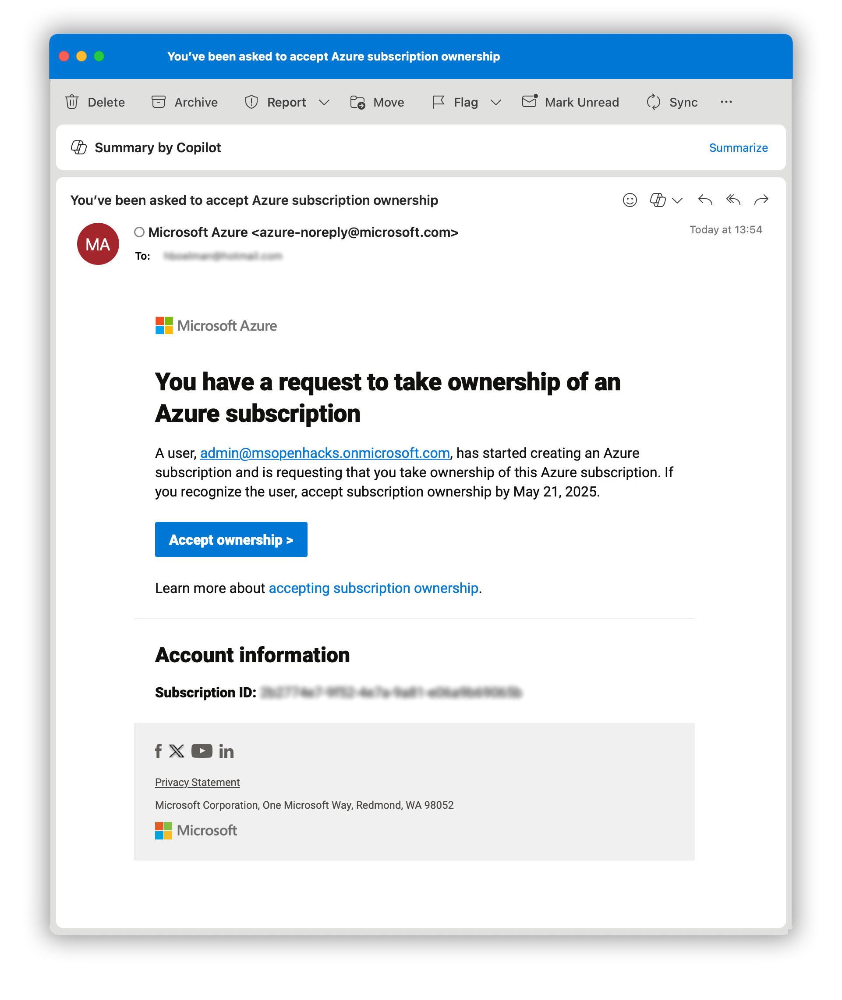
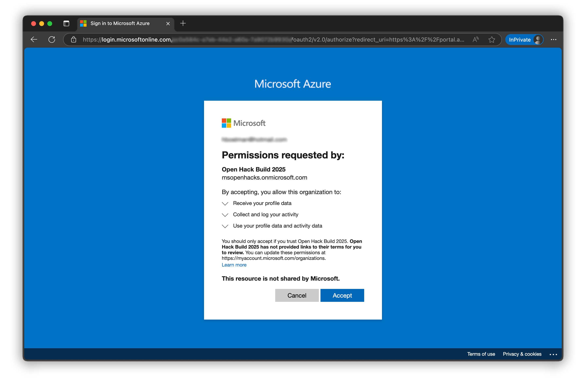
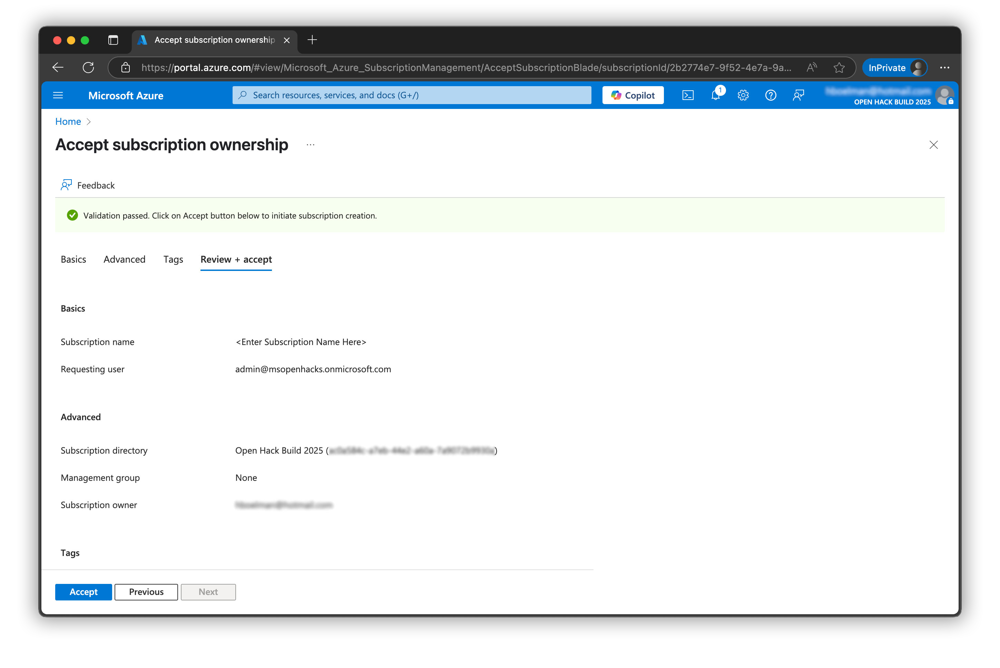
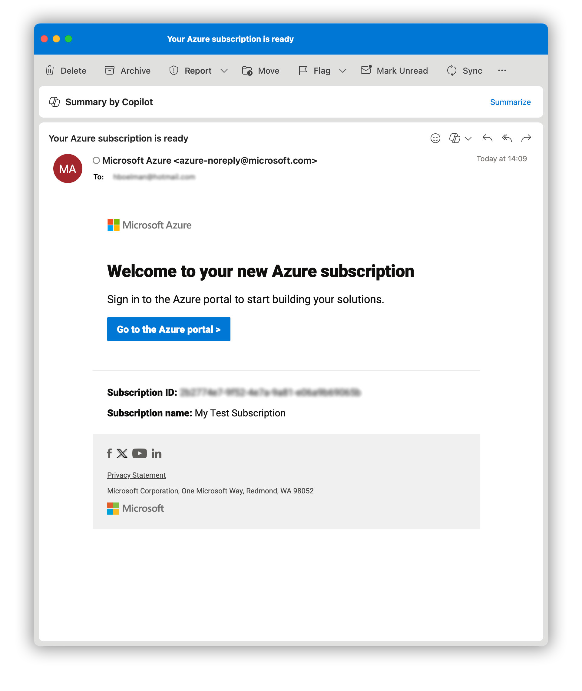
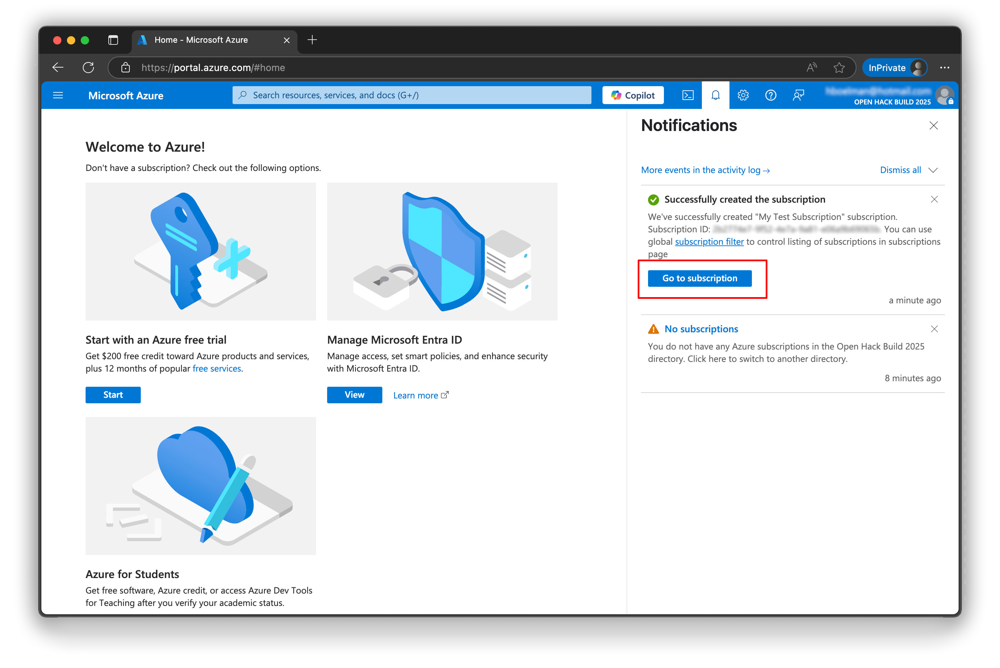

# Get an Azure Subscription

In case you do not have an Azure Subscription you can use to complete the challenges, 
you can follow the instructions below and get an Azure Subscription with 10$ credits valid for 5 days.

::: tip NOTE
This offer only applies for events provided by the Global AI Community on events like AgentCon
:::

## Step 1 - Request subscription
- Navigate to: [https://aka.ms/JoinEduLab](https://aka.ms/JoinEduLab)
- Sign in with a Microsoft or GitHub account

- Enter <!--@include: ./variables/azure-code.md--> the `invite code` and `click redeem`
- Wait for the email below to arrive

## Step 2 - Activate subscription
- Look out for the email below arriving in your mailbox.

- Click on the button `Accept Ownership`
- Login with the same account as in step 1

- After login, click `Accept` to login to the Open Hack tenant.

- You can use the suggested subscription name or create your own.
- Click `Review + Accept`

- Click `Accept`
- Your subscription is being created

## Step 3 - Happy hacking
- It can take a few minutes to create your subscription.

- When your subscription is ready you will get an email with subject: **Your Azure subscription is ready**

- You can also find the status of the subscription creation process under notifications.
- Click on "Go to subscription" in the notification or `Go to the Azure portal` in the email

Happy hacking!

## Tips & Tricks

### Unable to find your subscription?
- Your subscription is created in the Tenant/Directory: "Global AI Community"
- Sometimes you need to switch tenants, before you see the subscription. [Click here](https://portal.azure.com/#settings/directory) to switch Directory.
- Sometimes you need to adjust your [Subscription filter](https://portal.azure.com/#view/Microsoft_Azure_Billing/SubscriptionsBladeV2) for the subscription to show up.

