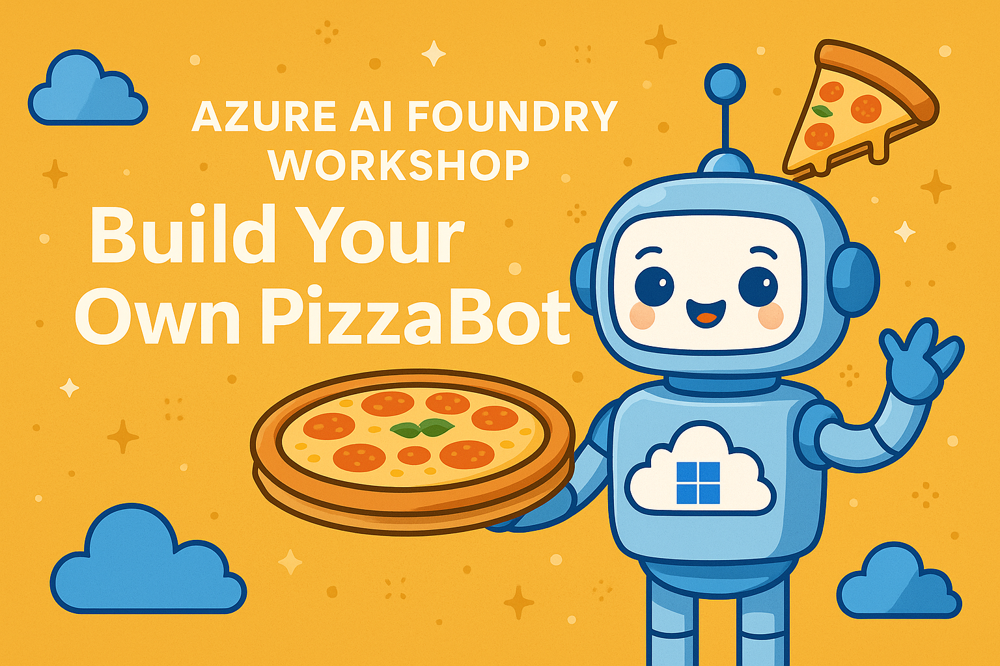

# Azure AI Foundry Agent Workshop 🚀  

## Workshop Overview  

In this hands-on session, you’ll learn how to build intelligent, domain-specific AI agents using **Azure AI Foundry Agent Service**.  
We’ll go step by step—from creating a basic agent to extending it with custom tools, external data, and live integrations.  

By the end of the workshop, you’ll have built your own **Contoso PizzaBot**, an AI assistant capable of:  
- Following tailored **system prompts**  
- Using **retrieval-augmented generation (RAG)** to answer questions from custom documents  
- Calling **custom tools** like a pizza calculator  
- Integrating with an **MCP server** for live menu and order management  

## Agenda (120 minutes total)  

- **Welcome & Setup**  
  Introduction, workshop goals, and Azure subscription setup  

- **Chapter 1: Create Your First Agent**  
  Log into Azure, install packages, and build a simple GPT-4o agent  

- **Chapter 2: System Prompts & Instructions**  
  Learn how prompts shape agent behavior and add custom instructions from `instructions.txt`  

- **Chapter 3: Adding Knowledge (RAG)**  
  Ground your agent in pizza store data using File Search and a vector store  

- **Chapter 4: Tool Calling**  
  Extend your agent with a custom pizza calculator function and toolset integration  

- **Chapter 5: MCP Integration**  
  Connect to an MCP server for live pizza menus, toppings, and order management  

- **Testing & Wrap-Up**  
  Test PizzaBot end-to-end, Q&A, and next steps  

## What You’ll Need  

- A browser and access to the [Azure Portal](https://portal.azure.com)  
- Your provided Azure subscription or your own for the workshop  
- Python 3.10+ installed locally  
- Familiarity with Python basics (no deep AI background required!)  

## Workshop Goal  

By the end of this 2-hour session, you’ll know how to:  
1. Create and configure an agent in Azure AI Foundry  
2. Guide its behavior with **system prompts**  
3. Ground it in real data using **RAG**  
4. Extend its functionality with **custom tools**  
5. Connect it to external services with **MCP**  

You’ll walk away with practical knowledge and a working **PizzaBot** agent you can build upon for real-world use cases.  
